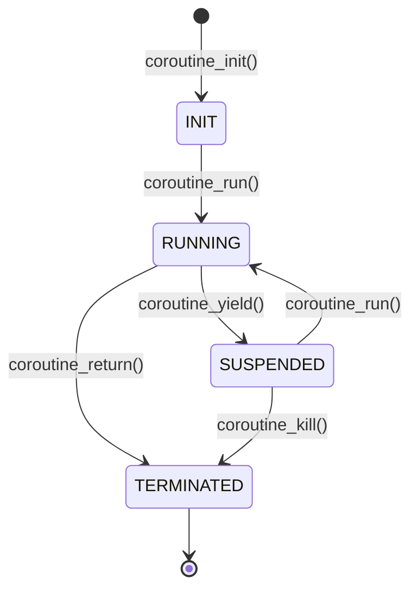

# x86_64 非对称栈式协程设计文档

## 1. 概述

本文档设计一套**非对称、栈式、非抢占式**协程，在 **x86_64 Linux 用户态**下运行。核心思想继承自项目中 MicroBlaze PMU 固件的协程实现，但针对 x86_64 架构重新设计。

### 1.1 术语

| 术语 | 说明 |
|------|------|
| **调用者** | 运行在主执行流中的代码，通过 `coroutine_run` 启动/恢复协程 |
| **协程** | 拥有独立栈的函数，通过 `coroutine_yield` 让出执行权 |
| **非对称** | 调用者和协程角色固定，`run` 和 `yield` 是不同函数 |
| **栈式** | 每个协程拥有独立的栈空间 |
| **非抢占式** | 协程必须主动调用 `yield` 才会让出 CPU |

### 1.2 设计目标

- 最小依赖：仅使用 C 语言 + 内联汇编，无外部库
- 轻量级：每个协程上下文仅 ~48 字节（6 个寄存器）
- 清晰语义：与 MicroBlaze 版本 API 兼容
- 栈保护：通过 `mprotect` 提供可选的栈溢出检测

---

## 2. API 设计

### 2.1 数据结构

```c
#include <stdint.h>
#include <stdbool.h>

typedef struct {
    uint64_t corSP;  // 协程栈指针，0 表示协程已结束
} CorPtr;
```

`corSP` 保存协程的 `rsp` 值。当 `corSP == 0` 时，表示协程已通过 `coroutine_return` 正常终止或被 `coroutine_kill` 销毁。

### 2.2 接口函数

```c
// 初始化协程：在 coStack 上预填充初始上下文
// 返回指向 CorPtr 的指针（即 coStack 本身）
CorPtr* coroutine_init(
    CorPtr* (*coFunction)(uint32_t runValue, CorPtr* coroutine),
    uint64_t* coStack,
    uint32_t len       // 字节数
);

// 运行/恢复协程：从调用者切换到协程
// 返回协程通过 yield/return 传递的值
uint32_t coroutine_run(uint32_t runValue, CorPtr* coroutine);

// 协程让出执行权：从协程切换回调用者
// 返回值会传递给调用者的 coroutine_run
uint32_t coroutine_yield(uint32_t runValue, CorPtr* coroutine);

// 协程永久终止：标记 corSP=0 并切回调用者
void coroutine_return(uint32_t runValue, CorPtr* coroutine);

// 查询协程是否已终止
bool coroutine_hasReturned(CorPtr* coroutine);

// 强制销毁协程
void coroutine_kill(CorPtr* coroutine);
```

### 2.3 协程函数签名

```c
CorPtr* my_coroutine(uint32_t runValue, CorPtr* co) {
    // 协程体
    uint32_t val = coroutine_yield(42, co);  // 让出，传递 42
    // ... 从 yield 返回后继续执行 ...
    coroutine_return(0, co);                  // 终止
}
```

协程函数返回 `CorPtr*` 是为了支持链式调用或 future 扩展，当前实现中返回值未被使用。

---

## 3. x86_64 寄存器约定

### 3.1 调用约定（System V AMD64 ABI）

| 寄存器 | 类型 | 用途 |
|--------|------|------|
| `rax` | 临时 | 返回值 |
| `rbx` | **Callee-saved** | 被调用者保存 |
| `rcx` | 临时 | 第 4 个参数 |
| `rdx` | 临时 | 第 3 个参数 |
| `rsi` | 临时 | 第 2 个参数 |
| `rdi` | 临时 | 第 1 个参数 |
| `rbp` | **Callee-saved** | 帧指针 |
| `rsp` | **栈指针** | 栈顶 |
| `r8` | 临时 | 第 5 个参数 |
| `r9` | 临时 | 第 6 个参数 |
| `r10-r11` | 临时 | |
| `r12-r15` | **Callee-saved** | 被调用者保存 |
| `xmm0-xmm7` | 临时 | 浮点参数/返回值 |

### 3.2 协程需要保存的寄存器

协程切换时只需保存/恢复 **Callee-saved 寄存器**（共 6 个），因为这些寄存器是调用者期望保持不变的：

```
rbx, rbp, r12, r13, r14, r15
```

**不需要保存**的寄存器：
- `rax, rcx, rdx, rsi, rdi, r8-r11` — 调用者已将它们视为可能被破坏的
- `xmm0-xmm15` — 如果协程不使用浮点，可忽略（简化版本）

### 3.3 参数传递

| 参数 | 寄存器 |
|------|--------|
| `runValue` (arg1) | `rdi` |
| `coroutine` (arg2) | `rsi` |
| 返回值 | `rax` |

---

## 4. 核心实现原理

### 4.1 协程生命周期



### 4.2 栈布局

```
协程栈 coStack（从低地址到高地址）:

低地址
  ┌──────────────────────────────┐
  │  CorPtr.corSP                │ ← coStack 起始地址
  ├──────────────────────────────┤
  │                              │
  │   协程实际使用的栈空间        │
  │   （局部变量、函数调用链）    │
  │                              │
  ├──────────────────────────────┤ ← savedRegsStart (corSP 指向这里)
  │  [r15]  callee-saved         │ ← 偏移 0 (最先 push)
  │  [r14]  callee-saved         │ ← 偏移 8
  │  [r13]  callee-saved         │ ← 偏移 16
  │  [r12]  callee-saved         │ ← 偏移 24
  │  [rbp]  callee-saved         │ ← 偏移 32
  │  [rbx]  callee-saved         │ ← 偏移 40 (最后 push)
  ├──────────────────────────────┤
  │  [返回地址]  coFunction      │ ← 偏移 48 (最先被 ret 弹出)
  └──────────────────────────────┘ ← coStack + len (高地址)
```

### 4.3 初始化：`coroutine_init()`

在栈顶预填充初始上下文，使 `coroutine_run` 首次执行时能正确跳转到协程函数。

```c
CorPtr* coroutine_init(CorPtr* (*coFunction)(uint32_t, CorPtr*),
                       uint64_t* coStack, uint32_t len)
{
    // 1. 计算栈顶位置（按 8 字节对齐）
    uint64_t* stack_top = (uint64_t*)((uint8_t*)coStack + len);

    // 2. 压入初始返回地址（协程函数入口）
    //    当 coroutine_run 执行 ret 时，会跳转到 coFunction
    *(--stack_top) = (uint64_t)coFunction;

    // 3. 预留 6 个 callee-saved 寄存器的空间
    //    这些位置在首次 run 时会被 LOAD_RX 加载
    //    初始值无关紧要，因为协程函数会自行设置
    stack_top -= 6;  // rbx, rbp, r12, r13, r14, r15

    // 4. corSP 指向寄存器帧起始
    //    coroutine_run 会从这里 pop 6 个寄存器，然后 ret
    ((CorPtr*)coStack)->corSP = (uint64_t)stack_top;

    return (CorPtr*)coStack;
}
```

**关键点**：`ret` 指令会弹出栈顶的返回地址并跳转。首次 `coroutine_run` 执行 `ret` 时，弹出的是 `coFunction`，因此直接进入协程函数。

### 4.4 运行/恢复：`coroutine_run()`

```asm
# coroutine_run(uint32_t runValue, CorPtr* coroutine)
# rdi = runValue, rsi = coroutine
coroutine_run:
    # === 阶段 1: 保存调用者上下文 ===

    # 保存 6 个 callee-saved 寄存器到调用者栈
    push    rbx
    push    rbp
    push    r12
    push    r13
    push    r14
    push    r15

    # === 阶段 2: 切换栈指针 ===

    # 从 CorPtr 加载协程的栈指针
    mov     rax, [rsi]          # rax = coroutine->corSP

    # 将调用者的当前 rsp 保存到 CorPtr
    # 这样协程 yield 时能找到调用者的寄存器帧
    mov     [rsi], rsp

    # 切换栈指针到协程栈
    mov     rsp, rax

    # === 阶段 3: 恢复协程上下文 ===

    # 弹出 6 个 callee-saved 寄存器
    pop     r15
    pop     r14
    pop     r13
    pop     r12
    pop     rbp
    pop     rbx

    # === 阶段 4: 跳转到协程 ===

    # ret 弹出栈顶的返回地址并跳转
    # 首次执行：弹出 coFunction，进入协程函数
    # 后续执行：弹出 yield 时保存的返回地址，回到 yield 之后
    ret
```

**执行流程分解**：

```
调用者栈（切换前）:
┌──────────────┐
│ 调用者栈帧    │ ← rsp
└──────────────┘

push rbx..r15 后:
┌──────────────┐
│ 调用者栈帧    │
│ r15          │
│ r14          │
│ r13          │
│ r12          │
│ rbp          │
│ rbx          │ ← rsp
└──────────────┘

mov [rsi], rsp → CorPtr 保存调用者 rsp
mov rsp, rax  → 切换到协程栈

协程栈（切换后）:
┌──────────────┐
│ r15          │ ← 被 pop r15
│ r14          │ ← 被 pop r14
│ r13          │ ← 被 pop r13
│ r12          │ ← 被 pop r12
│ rbp          │ ← 被 pop rbp
│ rbx          │ ← 被 pop rbx
│ 返回地址      │ ← 被 ret 弹出 → 跳转到协程
└──────────────┘ ← 原 corSP 位置
```

### 4.5 让出：`coroutine_yield()`

```asm
# coroutine_yield(uint32_t runValue, CorPtr* coroutine)
# rdi = runValue, rsi = coroutine
coroutine_yield:
    # === 阶段 1: 保存协程上下文 ===

    # 保存 6 个 callee-saved 寄存器到协程栈
    push    rbx
    push    rbp
    push    r12
    push    r13
    push    r14
    push    r15

    # === 阶段 2: 切换栈指针 ===

    # 从 CorPtr 加载调用者的栈指针
    mov     rax, [rsi]          # rax = coroutine->corSP（保存的是调用者 rsp）

    # 将协程的当前 rsp 保存到 CorPtr
    mov     [rsi], rsp

    # 切换栈指针到调用者栈
    mov     rsp, rax

    # === 阶段 3: 恢复调用者上下文 ===

    # 弹出 6 个 callee-saved 寄存器
    pop     r15
    pop     r14
    pop     r13
    pop     r12
    pop     rbp
    pop     rbx

    # === 阶段 4: 返回调用者 ===

    # 设置返回值
    mov     rax, rdi            # rax = runValue

    # ret 弹出调用者栈上的返回地址
    # 回到 coroutine_run 中 ret 之后的下一条指令
    ret
```

### 4.6 终止：`coroutine_return()`

与 `yield` 几乎相同，但多一步：将 `corSP` 清零标记结束。

```asm
# coroutine_return(uint32_t runValue, CorPtr* coroutine)
coroutine_return:
    # 保存协程寄存器（同 yield）
    push    rbx
    push    rbp
    push    r12
    push    r13
    push    r14
    push    r15

    # 加载调用者栈指针
    mov     rax, [rsi]

    # ★ 标记协程已结束：corSP = 0
    mov     qword ptr [rsi], 0

    # 切换栈指针
    mov     [rsi], rsp          # 实际上这步在 corSP=0 后已无意义
    mov     rsp, rax

    # 恢复调用者寄存器
    pop     r15
    pop     r14
    pop     r13
    pop     r12
    pop     rbp
    pop     rbx

    # 返回
    mov     rax, rdi
    ret
```

### 4.7 状态查询与销毁

```c
bool coroutine_hasReturned(CorPtr* coroutine) {
    return (coroutine->corSP == 0);
}

void coroutine_kill(CorPtr* coroutine) {
    coroutine->corSP = 0;
}
```

---

## 5. 完整调用时序

```mermaid
sequenceDiagram
    participant Main as 调用者(main)
    participant Run as coroutine_run
    participant Co as 协程函数
    participant Yield as coroutine_yield
    participant Ret as coroutine_return

    Note over Main,Co: === 初始化 ===
    Main->>Main: coroutine_init(FibFunc, stack, 4096)
    Note right of Main: 栈顶填充: [返回地址=FibFunc][6个寄存器槽]<br/>corSP 指向寄存器槽起始

    Note over Main,Co: === 第 1 次 run ===
    Main->>Run: coroutine_run(0, co)
    Run->>Run: push rbx,rbp,r12-r15 (保存调用者)
    Run->>Run: corSP→rax, rsp→corSP, rax→rsp
    Run->>Run: pop r15,r14,r13,r12,rbp,rbx
    Run->>Co: ret → 跳转到 FibFunc

    Note over Co: 协程开始
    Co->>Co: volatile u32 a=1, b=0
    Co->>Co: coroutine_yield(b, co) → yield(0, co)

    Co->>Yield: push rbx,rbp,r12-r15 (保存协程)
    Yield->>Yield: corSP→rax, rsp→corSP, rax→rsp
    Yield->>Yield: pop r15,r14,r13,r12,rbp,rbx
    Yield-->>Main: return 0

    Note over Main: 调用者拿到返回值 0

    Note over Main,Co: === 第 2 次 run ===
    Main->>Run: coroutine_run(0, co)
    Run->>Run: push/pop/switch
    Run->>Co: ret → 回到 yield 之后

    Note over Co: 从 yield 继续
    Co->>Co: temp=a+b; b=a; a=temp; → b=1
    Co->>Co: coroutine_yield(b, co) → yield(1, co)
    Co-->>Yield: ...
    Yield-->>Main: return 1

    Note over Main,Co: === 第 N 次 run... ===

    Note over Co: 协程决定终止
    Co->>Ret: coroutine_return(0, co)
    Ret->>Ret: corSP = 0
    Ret-->>Main: return 0

    Note over Main: coroutine_hasReturned() == true
```

---

## 6. 使用示例

### 6.1 Fibonacci 协程

```c
#include <stdio.h>
#include "llsw_coroutine.h"

#define STACK_SIZE 4096

uint64_t fib_stack[STACK_SIZE / 8];

CorPtr* FibonacciCoroutine(uint32_t runValue, CorPtr* co) {
    volatile uint32_t a = 1, b = 0, temp;
    (void)runValue;

    while (1) {
        coroutine_yield(b, co);
        temp = a + b;
        b = a;
        a = temp;
    }
}

int main() {
    CorPtr* fib = coroutine_init(&FibonacciCoroutine, fib_stack, sizeof(fib_stack));

    for (int i = 0; i < 10; i++) {
        uint32_t val = coroutine_run(0, fib);
        printf("Fibonacci[%d] = %u\n", i, val);
    }

    coroutine_kill(fib);
    return 0;
}
```

### 6.2 有限状态协程

```c
CorPtr* OneTwoThree(uint32_t runValue, CorPtr* co) {
    (void)runValue;
    coroutine_yield(1, co);
    coroutine_yield(2, co);
    coroutine_yield(3, co);
    coroutine_return(4, co);  // 终止
}

void test_finite() {
    uint64_t stack[256];
    CorPtr* co = coroutine_init(&OneTwoThree, stack, sizeof(stack));

    while (!coroutine_hasReturned(co)) {
        uint32_t val = coroutine_run(0, co);
        printf("Got: %u\n", val);
    }
    // 输出: Got: 1, Got: 2, Got: 3, Got: 4
}
```

---

## 7. 栈保护策略

x86_64 没有 MicroBlaze 的硬件栈限寄存器（rshr/rslr），但可以通过以下方式提供保护：

### 7.1 守护页法（推荐）

```c
#include <sys/mman.h>
#include <unistd.h>

// 分配带守护页的协程栈
void* alloc_guarded_stack(size_t size) {
    size_t page_size = sysconf(_SC_PAGESIZE);
    size_t total = size + page_size;  // 多一页作为守护页

    void* mem = mmap(NULL, total, PROT_READ | PROT_WRITE,
                     MAP_PRIVATE | MAP_ANONYMOUS, -1, 0);
    // 最后一页设为不可访问
    mprotect((char*)mem + size, page_size, PROT_NONE);

    // 协程栈从高地址向下增长，守护页在底部
    return mem;
}
```

当协程栈溢出时，会立即触发 `SIGSEGV`，便于调试。

### 7.2 栈水印法

```c
// 初始化时在栈底填充特定模式
#define STACK_CANARY 0xDEADBEEFCAFEBABE

void fill_canary(uint64_t* stack, size_t len) {
    for (size_t i = 0; i < len / sizeof(uint64_t) / 4; i++) {
        stack[i] = STACK_CANARY;
    }
}

// 检查栈使用量
size_t check_stack_usage(uint64_t* stack, size_t len) {
    size_t count = 0;
    for (size_t i = 0; i < len / sizeof(uint64_t) / 4; i++) {
        if (stack[i] != STACK_CANARY) count++;
        else break;
    }
    return count * sizeof(uint64_t);
}
```

---

## 8. 与 MicroBlaze 版本的对比

| 特性 | MicroBlaze 版本 | x86_64 版本 |
|------|----------------|-------------|
| **保存寄存器数** | 13 个 (r15, r19-r31) | 6 个 (rbx, rbp, r12-r15) |
| **栈帧大小** | 64 字节 (16×4) | 56 字节 (7×8: 6 regs + 1 ret addr) |
| **栈保护** | 硬件 rshr/rslr | 软件 mprotect 守护页 |
| **中断安全** | msrclr/mts rmsr | 用户态无需处理 |
| **延迟槽** | 需 -8 偏移 | 无 |
| **参数传递** | r5=arg1, r6=arg2, r3=ret | rdi=arg1, rsi=arg2, rax=ret |
| **返回指令** | rtsd r15, 8 | ret |
| **指针大小** | 4 字节 (u32) | 8 字节 (uint64_t) |
| **汇编代码量** | ~150 行 | ~40 行 |

---

## 9. 注意事项与限制

### 9.1 已知限制

1. **无浮点/向量寄存器保存** — 如果协程中使用 `xmm` 寄存器，需要在上下文中额外保存。当前设计假设协程仅使用通用寄存器。
2. **无信号栈安全** — 信号处理函数可能破坏协程栈。如果需要在信号中安全使用，需加 `sigaltstack`。
3. **栈大小固定** — 初始化时分配，无法动态增长。需根据协程最大调用深度合理估算。
4. **非线程安全** — 同一协程不能同时在多个线程中运行。如需多线程，需加锁或使用 TLS。

### 9.2 调试建议

- 使用 `-fno-omit-frame-pointer` 编译，保留 `rbp` 帧指针以便 gdb 回溯
- 在协程入口和出口加 `asm volatile("# CO BEGIN" :::)` 标记，便于在反汇编中定位
- 使用 `coroutine_hasReturned` 检查状态，避免对已终止协程调用 `coroutine_run`

### 9.3 编译要求

```bash
# 需要支持 GNU 扩展内联汇编的编译器（GCC/Clang）
gcc -O2 -fno-omit-frame-pointer -o coroutine_test main.c coroutine.c coroutine_asm.S
```

---

## 10. 文件结构

```
x86_64_coroutine/
├── llsw_coroutine.h      # API 头文件（数据结构 + 函数声明）
├── coroutine.c           # C 实现（init, hasReturned, kill）
├── coroutine_asm.S       # 汇编实现（run, yield, return）
├── test_coroutine.c      # 测试用例
└── Makefile              # 构建文件
```

---

## 附录 A：完整汇编源码

### `coroutine_asm.S`

```asm
.text
.globl  coroutine_run
.type   coroutine_run, @function
.align  16

# uint32_t coroutine_run(uint32_t runValue, CorPtr* coroutine)
# rdi = runValue, rsi = coroutine
coroutine_run:
    # 保存调用者 callee-saved 寄存器
    push    rbx
    push    rbp
    push    r12
    push    r13
    push    r14
    push    r15

    # 加载协程 SP，保存调用者 SP
    mov     rax, [rsi]          # rax = coroutine->corSP
    mov     [rsi], rsp          # coroutine->corSP = 调用者 rsp
    mov     rsp, rax            # rsp = 协程栈指针

    # 恢复协程寄存器
    pop     r15
    pop     r14
    pop     r13
    pop     r12
    pop     rbp
    pop     rbx

    # 跳转到协程
    ret
.size   coroutine_run, .-coroutine_run


.globl  coroutine_yield
.type   coroutine_yield, @function
.align  16

# uint32_t coroutine_yield(uint32_t runValue, CorPtr* coroutine)
coroutine_yield:
    # 保存协程 callee-saved 寄存器
    push    rbx
    push    rbp
    push    r12
    push    r13
    push    r14
    push    r15

    # 加载调用者 SP，保存协程 SP
    mov     rax, [rsi]          # rax = coroutine->corSP (调用者 rsp)
    mov     [rsi], rsp          # coroutine->corSP = 协程 rsp
    mov     rsp, rax            # rsp = 调用者栈指针

    # 恢复调用者寄存器
    pop     r15
    pop     r14
    pop     r13
    pop     r12
    pop     rbp
    pop     rbx

    # 返回 runValue
    mov     rax, rdi
    ret
.size   coroutine_yield, .-coroutine_yield


.globl  coroutine_return
.type   coroutine_return, @function
.align  16

# void coroutine_return(uint32_t runValue, CorPtr* coroutine)
coroutine_return:
    # 保存协程 callee-saved 寄存器
    push    rbx
    push    rbp
    push    r12
    push    r13
    push    r14
    push    r15

    # 加载调用者 SP
    mov     rax, [rsi]          # rax = coroutine->corSP (调用者 rsp)

    # 标记协程已结束
    mov     qword ptr [rsi], 0  # coroutine->corSP = 0

    # 切换栈指针
    mov     rsp, rax            # rsp = 调用者栈指针

    # 恢复调用者寄存器
    pop     r15
    pop     r14
    pop     r13
    pop     r12
    pop     rbp
    pop     rbx

    # 返回 runValue
    mov     rax, rdi
    ret
.size   coroutine_return, .-coroutine_return
```

## 附录 B：完整 C 源码

### `coroutine.c`

```c
#include "llsw_coroutine.h"

#define MIN_STACK_LEN (64)  // 至少 64 字节
#define SAVED_REGS_SIZE (7 * 8)  // 6 regs + 1 ret addr = 56 bytes

bool coroutine_hasReturned(CorPtr* coroutine) {
    return (coroutine->corSP == 0);
}

void coroutine_kill(CorPtr* coroutine) {
    coroutine->corSP = 0;
}

CorPtr* coroutine_init(CorPtr* (*coFunction)(uint32_t, CorPtr*),
                       uint64_t* coStack, uint32_t len)
{
    // 参数校验
    if (coStack == NULL || len < (sizeof(CorPtr) + MIN_STACK_LEN)) {
        return NULL;
    }

    // 计算寄存器帧起始位置（栈顶向下）
    uint64_t* stack_top = (uint64_t*)((uint8_t*)coStack + len);

    // 压入初始返回地址 = 协程函数入口
    *(--stack_top) = (uint64_t)coFunction;

    // 预留 6 个 callee-saved 寄存器槽位
    stack_top -= 6;

    // corSP 指向寄存器帧起始
    ((CorPtr*)coStack)->corSP = (uint64_t)stack_top;

    return (CorPtr*)coStack;
}
```
