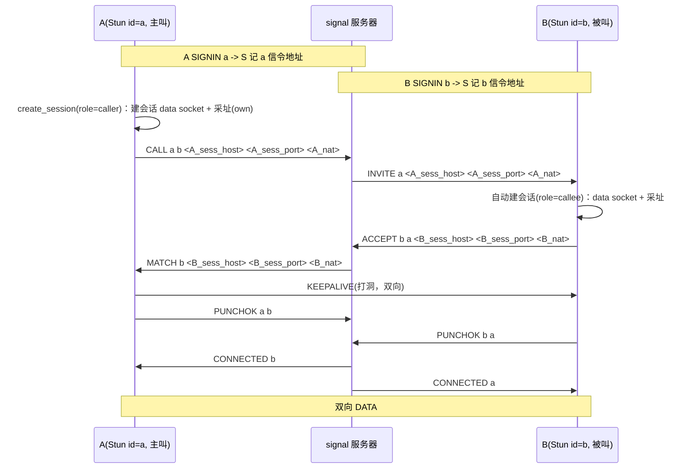

# p2p 设计说明（Stun 多会话 + p2p 薄层 + 中心服务器）

> 状态：**已实现**（V3，2026-09）。回归：`test_p2p_loopback` / `test_p2p_multi` PASS。
> 使用/构建/测试命令/排障见 [`README.md`](README.md)；本文只讲设计与协议。

## 1. 目标与模型

- 目标：一个节点可**同时与多个对端建链**，也可同时被多个对端呼叫；每端随时可发起，
  另一端临时在线即可被叫。
- 分层取向：
  - **Stun = 节点 + 会话管理器**。节点负责与信令服务器的常驻会话（上线 `SIGNIN`、下线
    `SIGNOUT`、收发信令）；会话表为每条到某 remote stun id 的链路。
  - **p2p = 薄整合层**（公共头 [`p2p.h`](../../src/include/libobject/net/p2p/p2p.h)）：构造
    Stun、桥接业务收包、转发 node/session 调用；**不持有会话表、不分配会话内存**。
  - 会话句柄即 Stun 内 `stun_session`，生命周期与并发多路由 Stun 统一管理。
- 连接“真正成功”以服务器为准：双方各自打洞成功后上报 `PUNCHOK`，服务器收齐两边才回
  `CONNECTED`。**`ACCEPT` 只表示“愿意配合打洞”，不等于连接成功。**

## 2. 概念与命名

| 词 | 含义 |
| --- | --- |
| stun id | 一个节点的唯一身份（构造时给定）。节点 = 一个 Stun 对象。 |
| signal 服务器 | 中心服务器：登记 `stun id -> 信令源地址`、撮合、STUN 回显。 |
| session | 一条到某节点的链路。会话表 key = **目标 stun id**。 |
| 会话 data socket | 该会话**独立的本地 UDP socket**（绑 `local_host` + `local_service`/随机口），有自己的公网映射。 |
| own / peer 地址 | own = 本会话经 NAT 后的公网映射（本 socket 采址）；peer = 对端本会话地址（信令交换所得，打洞目标）。 |
| peer_id | **已废弃**，不再出现在字段/接口中；发起 `CALL` 的参数是**目标 stun id**。 |

## 3. 数据结构

### 3.1 `Stun`（节点级，[`Stun.h`](../../src/net/p2p/stun/Stun.h:109)）

```c
struct Stun_s {
    /* ...方法指针(Vfunc)... */

    /* 节点身份 / 信令 */
    char   stun_id[32];              /* 本节点 stun id（SIGNIN 记录） */
    Client *server_client;           /* 与信令服务器的常驻会话(信令口)：收 INVITE/MATCH/CONNECTED 文本 */
    Map    *sessions;                /* 会话表：remote stun id -> stun_session_t* */

    /* 地址配置 */
    char *local_host, *local_service;    /* 会话 data socket 绑定 host/端口(NULL=随机) */
    char *signal_host, *signal_service;  /* 信令服务器 */
    char *stun_host, *stun_service;      /* 主 STUN（采址）；缺省用信令服务器 */
    char *stun2_host, *stun2_service;    /* 第二 STUN（对称探测）；NULL=不探测 */

    int  register_done;              /* SIGNIN 同步等 OK */
    int (*recv_callback)(Stun *, stun_session_t *, uint8_t *, int); /* DATA 上抛 */
    void *opaque;
    int  keepalive_interval_ms;      /* 默认保活周期（会话建时继承） */
};
```

### 3.2 `stun_session_t`（会话级，[`Stun.h`](../../src/net/p2p/stun/Stun.h:44)）

```c
struct stun_session_s {
    char remote_id[32];                     /* 对端 stun id（=会话表 key） */

    Client *peer_client;                    /* 本会话独立 UDP data socket（不 connect、sendto） */
    char  own_host[64]; int own_port;        /* 本会话公网地址（本 socket 采址结果） */
    char  peer_host[64]; int peer_port;      /* 对端本会话地址（信令交换 + 源地址学习） */
    int   peer_nat_type;                     /* 对端 NAT（撮合回执带回） */
    int   nat_type;                          /* 本端 NAT：双目的地探测，STUN_NAT_TYPE_* */

    int role;                                /* 0=caller 主叫；1=callee 被叫 */
    int own_ready;                           /* own 已采址就绪 */

    int state;                               /* STUN_SESSION_*（权威） */
    int connected, send_punch, data_received, active;

    void *keepalive_worker;                  /* 事件定时器（非线程） */
    int   keepalive_interval_ms;
    int (*recv)(void *opaque, const uint8_t *data, int len);  /* 本会话业务回调，NULL 走节点默认 */
    void *opaque;

    Request *req; Response *response;        /* 本会话采址独立编解码对象（多会话并发不共享） */
    Stun *stun;                              /* 回指所属节点 */
};
```

会话值由 `allocator_mem_alloc` 分配，放入 `stun->sessions`（Map，key=remote stun id），
由 Map trustee 统一释放（`del` 后不得再引用）。

### 3.3 P2P 数据面报文（[`Stun.h`](../../src/net/p2p/stun/Stun.h:89)）

```c
#define STUN_P2P_MAGIC         0x50325021   /* 'P2P!' */
#define STUN_P2P_MSG_KEEPALIVE 1            /* 打洞/保活（建链期与链路期共用） */
#define STUN_P2P_MSG_DATA      2            /* 业务数据 */
#define STUN_P2P_MAX_PAYLOAD   1400

typedef struct stun_p2p_msg_s { uint32_t magic; uint8_t type; uint16_t len; uint8_t data[0]; } stun_p2p_msg_t;
```

收到**任一** P2P 报文都证明“对端→本端”方向可达（用于打洞成功判定与源地址学习）。

## 4. 连接建立时序（服务器确认式）



要点：

- 采址就绪由回调按 role 分发：主叫 `call_session`（发 `CALL`）/ 被叫 `accept_session`
  （发 `ACCEPT`），把本会话地址带给对端；避免在回调里阻塞；
- 任一端成功收到对端 P2P 包 → 上报一次 `PUNCHOK`；只收到一方上报不判成功（等超时）；
- 服务器对同一次呼叫收齐双方 `PUNCHOK` → 回双方 `CONNECTED`，此时 `is_connected` 变 0。

## 5. 信令文本协议（V3，全部大写关键字，行尾 `\n`）

| 方向 | 报文 | 说明 |
| --- | --- | --- |
| peer→S | `SIGNIN <stun_id>` | 上线登记；S 记其**信令源地址**；回 `OK` |
| peer→S | `SIGNOUT <stun_id>` | 下线，S 删在线表项 |
| caller→S | `CALL <caller> <callee> <host> <port> [<nat>]` | 带本会话地址；S 转 `INVITE` 给被叫；被叫不在线回 `NOPEER <callee>` |
| S→callee | `INVITE <caller> <host> <port> <nat>` | 被叫据此建会话并采址 |
| callee→S | `ACCEPT <callee> <caller> <host> <port> [<nat>]` | 带本会话地址；S 转 `MATCH` 给主叫 |
| S→caller | `MATCH <callee_id> <host> <port> <nat>` | 服务器撮合回执（带被叫 id + 会话地址 + nat） |
| peer→S | `PUNCHOK <id> <peer_id>` | “id 已成功打洞到 peer_id” |
| S→双方 | `CONNECTED <peer_id>` | 双方都上报成功 |
| S→peer | `OK` / `NOPEER <id>` | 登记成功 / 对端不在线 |

- `nat` 为可选的 NAT 类型；旧对端不带时按 0(UNKNOWN) 处理（服务器解析 `n_arg` 兼容）；
- 信令关键字与 Stun vfunc 同名对齐：`SIGNIN`↔[`signin`](../../src/net/p2p/stun/Stun.c:605)、
  `SIGNOUT`↔[`signout`](../../src/net/p2p/stun/Stun.c:629)。

## 6. NAT 探测与 nat_type

- 时机：会话采址（`probe_session_addr`）即 `discovery` 内完成；配置了第二 STUN 时，
  先向主 STUN 采址，再向第二 STUN 采址，**用同一会话 socket** 比较两次外部映射。
- 判定（[`Stun.h`](../../src/net/p2p/stun/Stun.h:18)）：
  - 两次映射 host/port 相同 → `CONE`（非对称，可打洞）；
  - 不同 → `SYMMETRIC`（每新目的地换端口，需 TURN）；
  - 只配一个 STUN → `UNKNOWN`（默认仍尝试打洞）；无 NAT 直连公网为 `OPEN`。
- 传递链：本端 `nat_type` 随 `CALL`/`ACCEPT` 上报 → 服务器 `INVITE`/`MATCH` 透传
  （`P2p_Server.c` 的 `from_nat`/`to_nat`）→ 对端填 `peer_nat_type`。
- 日志会打印判断依据，便于核对（STUN 目标域名解析出的 IP 与各自回包来源映射）。

> 局限：两个公共 STUN 的采样只能近似判断全局对称性；`NAT` 也可能**按目的地**分配不同公网端口，
> 因此“到 STUN 的映射”不一定等于“到对端的映射”。这正是需要下节的源地址学习。

## 7. 源地址学习（打洞目标以真实源为准）

- 问题：真机实测中 A 对两个 STUN 稳定映射 `:19001`（判为 CONE），但对端 B 收到 A 的包
  却来自 `:21621` —— 即 NAT 对不同目的地分配了不同端口，信令上报的地址对“到对端这条路径”无效，
  导致 B 回发到 `:19001` 打不通。
- 做法：会话收到对端**任一** P2P 报文时，以报文**真实源地址**为准更新 `peer_host/peer_port`
  （后续 KEEPALIVE/DATA 都发到这里）；与信令上报不同时打差异日志：

```
<id> peer src differs: signaled <host>:<port> -> actual <host>:<port>
```

- 效果：一旦对端任何一个包先到达，本端即获得“对端到本端路径”上对端可用的源地址，从而回发；
  配合双方持续打洞，可显著提升端口受限/伪对称场景的成功率。
- 相关日志：`received KEEPALIVE from <peer> (<src_host>:<src_port>), sent PUNCHOK`。

## 8. 对外接口（[`p2p.h`](../../src/include/libobject/net/p2p/p2p.h)）

```c
typedef struct p2p_node_s p2p_node_t;        /* 不透明节点句柄 */
typedef struct p2p_session_s p2p_session_t;  /* 不透明会话句柄 */

typedef int (*p2p_recv_fn)(void *opaque, p2p_session_t *session,
                           const uint8_t *data, int len);

/* ===== 节点 ===== */
int p2p_node_create(p2p_node_t **out, p2p_recv_fn recv,
                    const p2p_cfg_t *cfg, void *opaque);  /* 0=在线 */
int p2p_node_close(p2p_node_t *node);                      /* SIGNOUT + 关全部会话 */
int p2p_node_is_alive(p2p_node_t *node);

/* ===== 会话 ===== */
int p2p_session_create(p2p_node_t *node, const char *remote_stun_id,
                       p2p_session_t **out);               /* 异步 CALL，不阻塞 */
int p2p_session_config(p2p_session_t *s, p2p_recv_fn recv, void *opaque);
int p2p_session_send(p2p_session_t *s, const uint8_t *data, int len);
int p2p_session_is_connected(p2p_session_t *s);            /* 0=可 send */
int p2p_session_close(p2p_session_t *s);                   /* 幂等 */

/* ===== 中心服务器 ===== */
int p2p_server_run(const char *host, const char *service); /* 阻塞至 Ctrl+C */
```

`p2p_cfg_t` 关键字段：`stun_id`（必填）、`local_host`/`local_service`（会话 socket 绑定）、
`signal_host`/`signal_service`（必填）、`stun_host`/`stun_service`（缺省用信令服务器）、
`stun2_host`/`stun2_service`（可空=不探测对称）、`interval_ms`、`turn_*`（预留）。

## 9. 回调分层与消息分流（同一 UDP 端口，按来源/阶段区分）

- **服务器信令**（`OK`/`INVITE`/`MATCH`/`NOPEER`/`CONNECTED`）：内置处理，**不上抛**；
- **对端预打洞/保活**（`KEEPALIVE` 等 P2P 报文，链路建立前）：内置处理，**不上抛**；
- **业务数据**（`DATA`）：链路打通后经 `recv_callback(stun, session, buf, len)` 上抛，
  p2p 桥接为 `p2p_recv_fn(opaque, session, data, len)` —— 用户可见的只有它。

## 10. 会话状态机

```
IDLE ──主叫 create_session ──▶ MAKING ──(MATCH)──▶ PUNCHING ──(CONNECTED)──▶ CONNECTED
  └────被叫 INVITE ──────────▶ RINGING ──(MATCH/对端包)──┘
任意状态 ──close/NOPEER/超时──▶ CLOSED
```

`state` 为权威，`connected` 是其等价缓存；`send_punch` 保证 `PUNCHOK` 只上报一次。

## 11. 保活与线程模型

- 全局一个 Producer/Event 线程承载所有 client socket（信令口 + 各会话 data socket）；
  **回调内不得阻塞**（否则死锁）。
- 保活是**事件定时器**（`keepalive_worker`），每会话一个，不是每会话一线程；
  会话关闭时 `worker_destroy`。
- 每会话独立 data socket：互不影响，一路失败/关闭不影响其它会话。

## 12. 中心服务器职责（[`P2p_Server.c`](../../src/net/p2p/P2p_Server.c)）

1. 地址簿：`SIGNIN` 记 `stun_id -> 信令源地址`（`INVITE`/`CONNECTED` 据此投递）；`SIGNOUT` 删除；
2. 撮合：`CALL`→`INVITE`；`ACCEPT`→`MATCH`；pending 支持同一主叫/被叫多路
   （key = `caller|callee`），`MATCH`/`CONNECTED` 带对端 stun id；
3. 打洞判定：按 pending 收集双方 `PUNCHOK`，双 ok 才回双方 `CONNECTED`；
4. STUN 回显（RFC 5389 Binding）；预留 TURN 中继（同进程）。

## 13. VPN 集成（常驻会话）

```c
static int vpn_recv(void *opaque, p2p_session_t *s, const uint8_t *d, int len)
{
    Tun *tun = opaque;
    return tun->write(tun, d, len);          /* 对端包注入本机 */
}

p2p_node_t *node = NULL;
p2p_node_create(&node, vpn_recv, &cfg, tun); /* 上线，可被叫 */

p2p_session_t *s = NULL;
p2p_session_create(node, remote_stun_id, &s); /* 异步 CALL（若本端为主动方） */
while (p2p_session_is_connected(s) != 0) { /* 等待打通（或由上层轮询/超时） */ }

for (;;) {                                   /* 出站转发；入站走回调，无需额外线程 */
    n = tun->read(tun, buf, sizeof(buf));
    if (n <= 0) break;
    p2p_session_send(s, buf, n);
}
p2p_session_close(s);
p2p_node_close(node);
```

要点：入站完全靠注册的 `recv` 回调；`p2p_session_send` 可跨线程（内部写锁）；
VPN 不感知 keepalive。

## 14. 语义边界与后续

- 双向都通才算成功：单向可达不会误报 `CONNECTED`；
- 双对称 NAT（双方都 `SYMMETRIC`）打洞大概率失败，需 TURN（预留，接口层可感知 `nat_type`）；
- 免费公共 STUN 的采样只近似：应结合源地址学习；必要时把第二 STUN 配成信令服务器
  （按“到信令路径”探测，与打洞路径更接近）；
- 后续：TURN 中继接入、包头显式标识/多对端网格、鉴权/白名单、防重放、心跳 TTL、
  在线订阅感知、崩溃残留的 TTL 清理。

## 15. 涉及文件

- [`src/net/p2p/stun/Stun.h`](../../src/net/p2p/stun/Stun.h) / [`Stun.c`](../../src/net/p2p/stun/Stun.c)
- [`src/net/p2p/P2p_Server.h`](../../src/net/p2p/P2p_Server.h) / [`P2p_Server.c`](../../src/net/p2p/P2p_Server.c)
- [`src/net/p2p/p2p.c`](../../src/net/p2p/p2p.c) / [`src/include/libobject/net/p2p/p2p.h`](../../src/include/libobject/net/p2p/p2p.h)
- [`tests/net/test_p2p.c`](../../tests/net/test_p2p.c)
