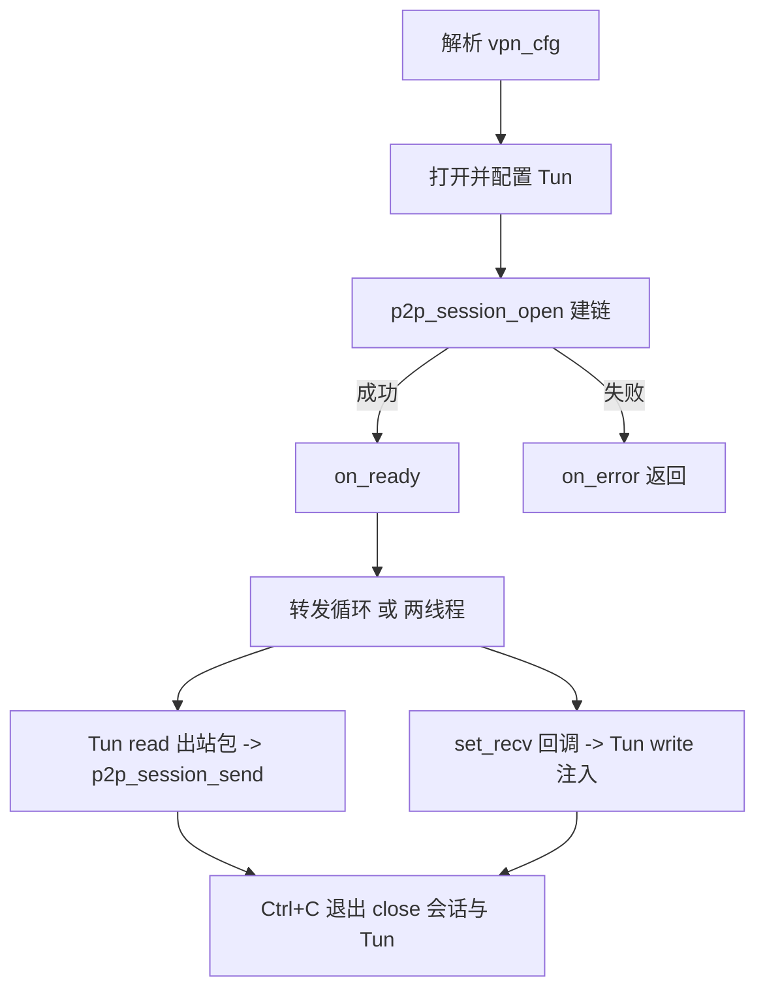

# P2P-VPN 模块设计定稿（net/vpn）

> 状态：定稿待实现。基于 p2p 通道基础设施做上层 VPN（站点间网段互访）。
> 归属：architect 产出；实现另起 code 任务，按末尾任务清单推进。

## 0. 结论速览（已定）

- `src/net/vpn` 与 `src/net/p2p` **平级并列**，`vpn → p2p` 单向依赖。
- P2P 打洞客户端（`net/p2p/stun`）**底层已具备收发+保活**；缺的是把
  “建链成功后长期 send/收包”以**常驻会话句柄**暴露给上层。
- **在公共 p2p 暴露常驻会话 API**（内部包 Stun）：`p2p_session_open / send /
  set_recv / close`。VPN 只用公共头。
- Tun 放 vpn 内部 `src/net/vpn/tun/`（Linux 先做，Windows 后续）。
- 首版：Linux TUN + **L3 路由模式** + 点对点；`configure` 用外部 `ip` 命令；
  不加隧道头、不加加密；保活由 p2p 会话内部维持。

## 1. 目录

```
src/net/
  p2p/                 # 基础设施（已有）：P2p_Server、stun/ 打洞客户端、turn/(预留)
  vpn/
    Vpn.h  Vpn.c       # 对外 VPN 入口 vpn_run + 配置
    tun/
      Tun.h  Tun.c     # 虚拟网卡抽象
      os/unix/Tun.c    # Linux TUN 实现（首版）
      os/window/Tap.c  # Windows TAP（后续）
```

## 2. P2P 常驻会话 API（新增，公共头 p2p.h）

```
typedef struct p2p_session_s p2p_session_t;   /* 不透明句柄 */

int p2p_session_open(p2p_session_t **s, const p2p_cfg_t *cfg);
    /* 复用打洞客户端：connect(信令)->[probe/discovery]->register->lookup->punch，
     * 成功后开启内部 keepalive，返回会话句柄；失败返回负值。不做“演示收发循环”。 */
int p2p_session_send(p2p_session_t *s, const uint8_t *data, int len);
int p2p_session_set_recv(p2p_session_t *s, void *opaque,
                         int (*recv)(void *opaque, const uint8_t *data, int len));
int p2p_session_close(p2p_session_t *s);      /* 停保活、释放 */
```

- 内部实现：持有 `Stun` 句柄；`send`→`Stun.send`；收包用内部回调转成
  `(opaque,data,len)` 交给上层；keepalive 用 `Stun.keepalive_start`。
- `p2p_peer_run` 保留为“一次性/自测”入口（内部可改为基于会话的演示，或维持现状，
  实现时选其一，避免重复代码）。

## 3. VPN 对外接口（草案）

```c
typedef struct vpn_cfg_s {
    /* p2p 通道（与 p2p_cfg_t 一致字段） */
    const char *id, *peer_id, *signal_host, *signal_service;
    const char *stun_host, *stun_service, *stun2_host, *stun2_service;
    /* 虚拟网卡 / 网段 */
    const char *tun_name;     /* tun0，可空(自动) */
    const char *local_ip;     /* 本端 tun IP */
    const char *netmask;
    const char *remote_cidr;  /* 对端网段，决定要加的路由 */
    /* 事件 */
    void (*on_ready)(void *opaque);
    void (*on_error)(void *opaque, int ret);
    void *opaque;
} vpn_cfg_t;

int vpn_run(const vpn_cfg_t *cfg);   /* 阻塞运行，Ctrl+C 停止 */
```

## 4. Tun 抽象（草案）

```
struct Tun_s {
    int fd; char name[16]; int mtu;
    open(dev)  -> create tun /dev/net/tun + TUNSETIFF
    configure(ip, netmask, remote_cidr)  -> 调外部 ip 命令配地址与路由
    read / write / set_mtu / close
};
```

## 5. VPN 会话流程



- 出站：tun->read 到 IP 包 → p2p_session_send（点对点，直接透传 IP 帧）。
- 入站：p2p_session_set_recv → tun->write。
- 首版不加隧道头（点对点单通道无需区分对端）；多 peer 时再加头。

## 6. 首版范围

- Linux TUN，L3 路由点对点；Linux /dev/net/tun，进程需 root 或 CAP_NET_ADMIN；
- 配置地址/路由用外部 ip 命令；
- 本机/两台 NAT 后“互 ping 对端 tun IP / 对端网段主机”为验收。

不做（后续增强）：多 peer 网格与 cidr→peer 路由、TAP/二层+ARP、Windows TAP、
加密、TURN 中继。

## 7. 实现任务清单

1. p2p：公共层新增 `p2p_session_open/send/set_recv/close`（包 Stun，含 keepalive；
   recv 转 `(opaque,data,len)`）；补一个常驻会话自测命令（两端持续互发）。
2. p2p：`p2p_peer_run` 与会话 API 二选一去重（建议 p2p_peer_run 改为基于会话的演示）。
3. vpn/tun：Tun 抽象 + Linux TUN 实现 + tun 自测（能与 ping 联调）。
4. vpn：Vpn.h/Vpn.c + `vpn_cfg_t` + `vpn_run`，打通 会话↔Tun 双向转发。
5. 对外 CLI（仿 test_p2p_*）双端互 ping 验收。
6. 文档 doc/net/vpn/README.md（架构/命令/权限/排障）。

## 8. 已决取舍记录

- 长连接 ≠ keepalive：keepalive 只是保活空包；缺的是“把已具备的收发暴露成常驻
  句柄给上层”。故加 p2p_session_*，而非新机制。
- 公共头只暴露扁平 p2p_cfg_t 与不透明会话句柄；内部 Stun 仅在 p2p 与 vpn? ——
  仅 p2p 内部引用（vpn 只用公共头）。
- Tun 先内聚 vpn；出现第二使用者再上提抽象层。
