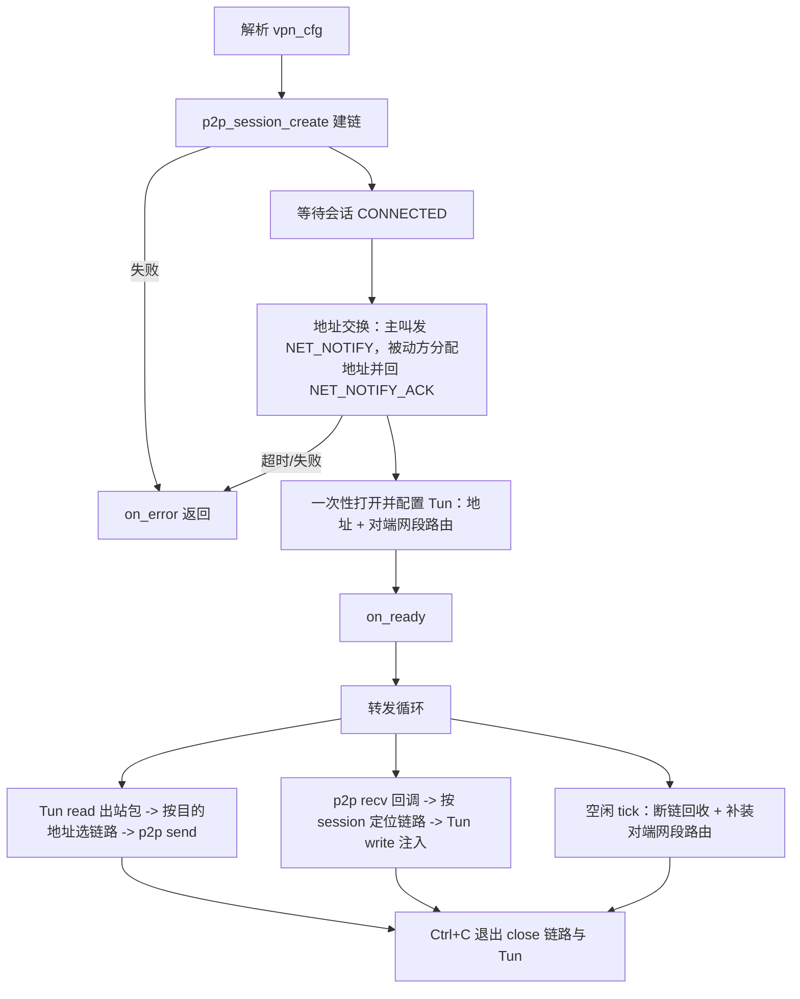

# P2P-VPN 模块设计定稿（net/vpn）

> 状态：**已实现**（Linux TUN + L3 路由；一个 tun 复用给多条链路 = 多对端）。
> 使用/命令/权限/排障见 [`README.md`](README.md)。
> 归属：architect 产出（设计）；实现见 [`src/net/vpn/Vpn.c`](../../src/net/vpn/Vpn.c) 与 `src/net/vpn/tun/`。

## 0. 结论速览（已定）

- `src/net/vpn` 与 `src/net/p2p` **平级并列**，`vpn → p2p` 单向依赖。
- P2P 打洞客户端（`net/p2p/stun`）**底层已具备收发+保活**；缺的是把
  “建链成功后长期 send/收包”以**常驻会话句柄**暴露给上层。
- **在公共 p2p 暴露常驻会话 API**（内部包 Stun）：`p2p_session_open / send /
  set_recv / close`。VPN 只用公共头。
- Tun 放 vpn 内部 `src/net/vpn/tun/`（Linux 先做，Windows 后续）。
- 首版：Linux TUN + **L3 路由模式**（一个 tun 可复用给多条链路）；`configure` 用外部 `ip` 命令；
  不加隧道头、不加加密；保活由 p2p 会话内部维持。
- 隧道地址由**被动方分配**：地址池 = 被动方自己的 `tunnel_ip` 前缀；主叫可省 `tunnel_ip`。

## 1. 目录

```
src/net/
  p2p/                 # 基础设施（已有）：P2p_Server、stun/ 打洞客户端、turn/(预留)
  vpn/
    Vpn.c              # 对外 VPN 入口 vpn_run + 配置（实现在此）
    Vpn_Command.c      # 命令行：xtools vpn ...
    Vpn_Server_Command.c # 服务端命令行：xtools vpnserver ...（复用 p2p_server_run）
    Vpn_Internal.h     # 模块内部定义：协议帧/结果码/net/link/ctx（含控制帧分派表）
    tun/
      Tun.h            # 虚拟网卡抽象（平台无关接口；vpn 内部）
      os/unix/Tun.c    # Linux TUN 实现（首版）
      os/window/Tap.c  # Windows TAP（后续，未做）
src/include/libobject/net/vpn/
    vpn.h              # 对外公共头：vpn_cfg_t + vpn_run
    Vpn_Command.h      # xtools vpn 的 Command 定义
    Vpn_Server_Command.h # xtools vpnserver 的 Command 定义
tests/net/
    test_vpn.c         # 测试命令 test_vpn_tun / test_vpn_peer
```

## 2. P2P 常驻会话 API（新增，公共头 p2p.h）

> 实现说明（2026-09）：p2p V3 已定为「node + session」多会话模型并**已实现**
> （[`p2p.h`](../../src/include/libobject/net/p2p/p2p.h) 的 `p2p_node_create` /
> `p2p_session_create / send / is_connected / close`，见 [`../p2p/p2p_design.md`](../p2p/p2p_design.md) §13）。
> **VPN 直接使用该既有 API**，本节原提案的 `p2p_session_open/set_recv` 不再单独新增，
> 「常驻会话 + 保活」由 node/session 模型天然满足（保活由 Stun 事件定时器维持）。

```
typedef struct p2p_session_s p2p_session_t;   /* 不透明句柄 */

int p2p_session_open(p2p_session_t **s, const p2p_cfg_t *cfg);
    /* 复用打洞客户端：connect(信令)->[probe/discovery]->register->lookup->punch，
     * 成功后开启内部 keepalive，返回会话句柄；失败返回负值。不做“演示收发循环”。 */
int p2p_session_send(p2p_session_t *s, const uint8_t *data, int len);
int p2p_session_set_recv(p2p_session_t *s, void *opaque,
                         int (*recv)(void *opaque, const uint8_t *data, int len));
int p2p_session_close(p2p_session_t *s);      /* 停保活、释放 */
```

- 内部实现：持有 `Stun` 句柄；`send`→`Stun.send`；收包用内部回调转成
  `(opaque,data,len)` 交给上层；keepalive 用 `Stun.keepalive_start`。
- `p2p_peer_run` 保留为“一次性/自测”入口（内部可改为基于会话的演示，或维持现状，
  实现时选其一，避免重复代码）。

## 3. VPN 对外接口（草案）

```c
typedef struct vpn_cfg_s {
    /* p2p 通道（与 p2p_cfg_t 一致字段） */
    const char *id, *peer_id, *signal_host, *signal_service;
    const char *stun_host, *stun_service, *stun2_host, *stun2_service;
    /* 虚拟网卡 / 网段 */
    const char *tun_name;     /* tun0，可空(自动) */
    const char *tunnel_ip;    /* 本端隧道地址，可带 "/len"；
                               * 被动方必填（同时是地址分配池，建议 x.x.x.254/24）；
                               * 主叫可空 —— 地址由对端分配 */
    const char *netmask;
    const char *local_net;    /* 本端内网网段：链路建立后自动通告对端 */
    /* 事件 */
    void (*on_ready)(void *opaque);
    void (*on_error)(void *opaque, int ret);
    void *opaque;
} vpn_cfg_t;

int vpn_run(const vpn_cfg_t *cfg);   /* 阻塞运行，Ctrl+C 停止 */
```

> 无 `remote_net`：对端网段 **一律**来自运行期交换（见 §8），没有手工配置对端路由的入口。

## 4. Tun 抽象（草案）

```
struct Tun_s {
    int fd; char name[16]; int mtu;
    open(dev)              -> create tun /dev/net/tun + TUNSETIFF
    configure(ip, netmask) -> 调外部 ip 命令只配地址（地址交换完成后调用一次）
    route_add(net)         -> 追加一条到 net 的路由（按对端通告，链路就绪后调用）
    read / write / set_mtu / close
};
```

## 5. VPN 会话流程



- **先交换、后配 tun**：地址没拿到之前不碰 tun；拿到后才 create + `configure` 一次，
  避免"配置了地址又回滚"。
- 出站：tun->read 到 IP 包 → 按目的地址选链路 → p2p_session_send（直接透传 IP 帧）。
- 入站：p2p recv 回调带 session，据此定位 link → tun->write。
- 首版不加隧道头：**"发给哪个对端"**由 vpn 层的"目的地址→链路"表决定，包内不需要对端标识。

## 6. 首版范围

- Linux TUN，L3 路由；Linux /dev/net/tun，进程需 root 或 CAP_NET_ADMIN；
- 配置地址/路由用外部 ip 命令；
- 本机/两台 NAT 后“互 ping 对端 tun IP / 对端网段主机”为验收。

不做（后续增强）：对端网段冲突检测/仲裁、跨对端中转（A↔C 经 hub）、TAP/二层+ARP、
Windows TAP、加密、TURN 中继。
（"多对端：一个 tun 复用给多条链路 + 目的地址→链路选路"本轮已实现，见 §8。）

## 7. 实现任务清单

1. ~~p2p：公共层新增 `p2p_session_open/send/set_recv/close`~~ —— **已由 p2p V3 的
   node/session API 覆盖**（见 §2 说明），无需新增。
2. ~~p2p：`p2p_peer_run` 与会话 API 去重~~ —— V3 已统一为 node/session 模型。
3. [x] vpn/tun：Tun 抽象 + Linux TUN 实现 + tun 自测
   （`test_vpn_tun`，CMD 无参、单机全自动探针自检，需 root）。
4. [x] vpn：`vpn.h`/`Vpn.c` + `vpn_cfg_t` + [`vpn_run`](../../src/include/libobject/net/vpn/vpn.h:50)，
   打通 会话↔Tun 双向转发。
5. [x] 对外 CLI：`tests/net/test_vpn.c`（`test_vpn_peer` 双端互 ping 验收）。
6. [x] 文档 [`doc/net/vpn/README.md`](README.md)（架构/命令/权限/排障）。
7. [x] 多对端：一个 tun 复用多条链路 + 目的地址选路 + 被动方地址分配
   （地址池 / 归还复用 / 断链回收）。
8. [x] 文档同步：README 与本文按新协议（`NET_NOTIFY` / `NET_NOTIFY_ACK`、先交换后配 tun）更新。

## 8. 已决取舍记录

- 长连接 ≠ keepalive：keepalive 只是保活空包；缺的是“把已具备的收发暴露成常驻
  句柄给上层”。故加 p2p_session_*，而非新机制。
- 公共头只暴露扁平 p2p_cfg_t 与不透明会话句柄；内部 Stun 仅在 p2p 与 vpn? ——
  仅 p2p 内部引用（vpn 只用公共头）。
- Tun 先内聚 vpn；出现第二使用者再上提抽象层。
- 网段信息**自动交换**：两端只填自己的内网网段（CLI `--local-net` / API `local_net`），
  链路建立后用 VPN 层控制帧互相通告，对端自动 `ip route replace`。
  **不存在"手工配置对端网段"这条路径**：原 `remote_net` 字段与命令行选项已整体删除，
  远程子网一律来自运行期交换。
- **一个 tun 复用给多条链路（多对端）**：被叫为**每个主叫**单独登记一条 link——recv 回调
  本身带 session 参数，天然能区分是谁，无需身份字段；出站按"对端隧道地址（精确）→
  对端内网网段（最长前缀）"选 link，内核路由只负责"把包引进 tun"（TUN 是无 ARP 设备，
  给不出 per-peer 下一跳，所以选路必须在 vpn 层）。
  随之把通告内容从"网段"扩展为"**隧道地址 + 网段**"（`NET_NOTIFY` 只带主叫自己的网段，
  可为空），并新增"目的地址为对端隧道地址"这条精确选路。
- **被动方是地址分配者**：地址池 = 被动方自己的 `--tunnel-ip` 前缀，按 link 槽位从 `.1`
  起分配（占用表 + 归还复用，被动方自身取 `.254`）；主叫可省 `--tunnel-ip`，
  由被动方在 `NET_NOTIFY_ACK` 里下发。
- **帧只有两种**：`NET_NOTIFY`（主叫→被动方，负载 = 主叫内网网段，可空）与
  `NET_NOTIFY_ACK`（被动方→主叫，负载 = 结果码 + 分配给主叫的隧道地址 + 被动方隧道地址
  + 被动方内网网段）；结果码非 0 表示拒绝及原因。
- **发送点只有一个**：主叫在 `vpn_exchange_addr` 里发出 `NET_NOTIFY`（约 1s 重传，
  直到收到 ACK 或超时）；"首次通告"与"丢包重传"是同一件事。
- **断链回收只在被动方做**：转发循环的空闲 tick 里检查，某链路连续 5 轮不可用
  （`VPN_LINK_BAD_ROUNDS`）即 `vpn_link_release`：关会话 + 归还地址 + 清空槽位；
  主叫侧不主动回收，链路生命周期跟随 vpn_run 主流程。
  权衡：单对端（主叫）时退化为直发，行为与之前一致。
  未做：对端网段冲突仲裁、跨对端中转、CLI 多 `-p`（主叫仍只连一个对端）。
